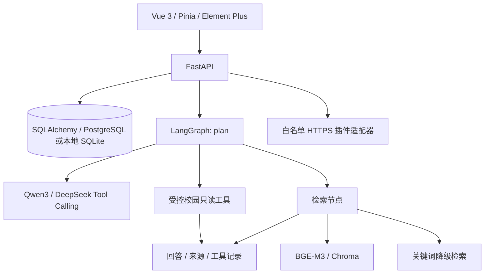

# 架构与接口

桌面模式新增 `desktop/main.cjs`（窗口、进程生命周期及受控 IPC）、`desktop/preload.cjs`（最小渲染桥）、`desktop/lib/backend.cjs`（后端进程管理）、`backend/desktop_entry.py`（随机端口、就绪握手及退出）、`app/desktop_runtime.py`（桌面鉴权与静态页面服务）。`scripts/build_desktop.py` 先运行测试，再经 PyInstaller + electron-builder 输出安装程序。桌面与网页共用业务 API；桌面模式的数据/配置和鉴权独立。详见 [DESKTOP.md](DESKTOP.md)。

`backend/app/main.py` 定义 API 与权限检查，`models.py` 定义会话、消息、文档、插件和报修表。`agent.py` 定义模型调用、工具注册、LangGraph 节点与多轮检索；`rag.py` 负责分段、索引版本管理和检索；`plugins.py` 限制外部连接；`services.py` 是学校接口的替换位置。

`frontend/src/App.vue` 提供问答、校园服务、知识库、插件和设置五个页面，`api.ts` 统一处理 HTTP 调用与错误，`store.ts` 保存模型偏好与当前会话 ID。

| 方法 | 路径 | 说明 |
| --- | --- | --- |
| GET | /api/health | 后端与模型配置状态 |
| POST | /api/chat | message、可选 conversation_id/model；返回 answer/sources/tool_calls/mode |
| POST | /api/chat/stream | 流式问答（SSE）：meta、delta、done、error；客户端中断时保存已生成内容并标记 partial |
| GET | /api/conversations | 历史会话列表（title/message_count/updated_at，按 client_id 隔离） |
| DELETE | /api/conversations/{id} | 删除单个会话（client_id 必须匹配） |
| DELETE | /api/conversations | 清空该 client_id 的全部会话 |
| GET | /api/conversations/{id} | 历史内容及来源和演示标识 |
| GET/POST | /api/documents | 列表 / JSON 正文创建 |
| POST | /api/documents/upload | multipart file 上传（TXT / Markdown / PDF / docx，docx 用标准库解析段落文本） |
| PUT | /api/documents/{id}/upload | multipart file 替换 |
| PUT/DELETE | /api/documents/{id} | JSON 正文更新 / 删除 |
| POST | /api/documents/reindex | 重建当前文档索引 |
| GET | /api/backup/export | 导出 zip 备份：campus.db 快照（VACUUM INTO）+ 配置文件 + SHA-256 清单 |
| POST | /api/backup/import | 导入备份：先校验清单与数据库结构，再经 SQLite backup API 恢复；配置变更需重启 |
| GET | /api/services/grades、schedule、credits | 演示校园查询 |
| GET | /api/services/classrooms | building、min_seats 筛选 |
| POST | /api/services/repairs | location、issue、contact 表单提交 |
| GET | /api/services/repairs | 本机报修记录（含联系方式，需管理员；桌面模式由桌面令牌自动授权） |
| GET | /api/update/check | 读取管理员配置的 HTTPS 更新清单（`UPDATE_MANIFEST_URL`）并比较版本；未配置时不联网 |
| GET | /api/web/status | 联网搜索是否启用、所选服务与可用性（聊天开关据此显示） |
| PUT | /api/web/config | 管理员启用/关闭联网搜索、切换 Bing/Tavily/博查、保存 API Key（DPAPI 加密） |
| GET/POST | /api/plugins | 插件列表 / JSON 清单直接登记 |
| POST | /api/plugins/install | 从 source HTTPS 清单地址安装 |
| PATCH/DELETE | /api/plugins/{id} | 启停或说明更新 / 卸载 |
| POST | /api/plugins/{name}/invoke | 管理员显式调用，正文为参数对象 |
| GET/PUT | /api/settings | 读取 / 修改本进程默认模型偏好 |

文档和插件写入、插件调用及设置更新需要 `X-Admin-Token`。前端模型偏好随每次问答发送，不修改服务器默认设置。启动后 `/docs` 为完整请求/响应模型的权威说明。

会话按 `client_id` 隔离：桌面版由主进程生成并保存在 `workspace.json`，网页版保存在浏览器本地存储；列表、删除与清空都要求匹配的 `client_id`，无 `client_id` 的历史会话会在下一次发言时归入请求方。流式接口的规划与检索在 `run_in_threadpool` 中同步执行，模型输出用异步 httpx 逐段转发，客户端断开后立即停止上游请求，并将已生成内容落库（`result_data.partial=true`）。

文档数据库是权威数据源。索引用正文与标题的哈希区分版本，检索校验数据库中的最新内容，避免返回已删除或过期分段。SQL 保存后索引失败返回成功保存及 `index_status=pending`，不会误导客户端重复上传。

默认每次请求的自动工具上限为一个，只能选择注册的四种只读校园查询；模型返回的任意其他工具名称不能被执行。报修通过表单提交，插件通过显式管理接口调用。

联网搜索默认关闭，由管理员在设置中开启（也可用 `.env` 的 `WEB_SEARCH_*`），聊天窗口再按每条消息选择是否联网。开启后检索结果与知识库资料一起编号注入提示词（网页条目带链接与检索时间，模型被要求给出来源链接），知识库无依据时也会因网页资料而不再直接放弃回答。出站请求与插件同一套约束：仅 HTTPS、连接固定到校验过的公网地址（保留 SNI/主机名校验，防 DNS 重绑定）、禁止跳转、大小与超时上限；页面正文用标准库 HTMLParser 提取，单个网页最多保留 2000 字，API Key 用 DPAPI 加密保存在数据目录的 `web-search.json`。
